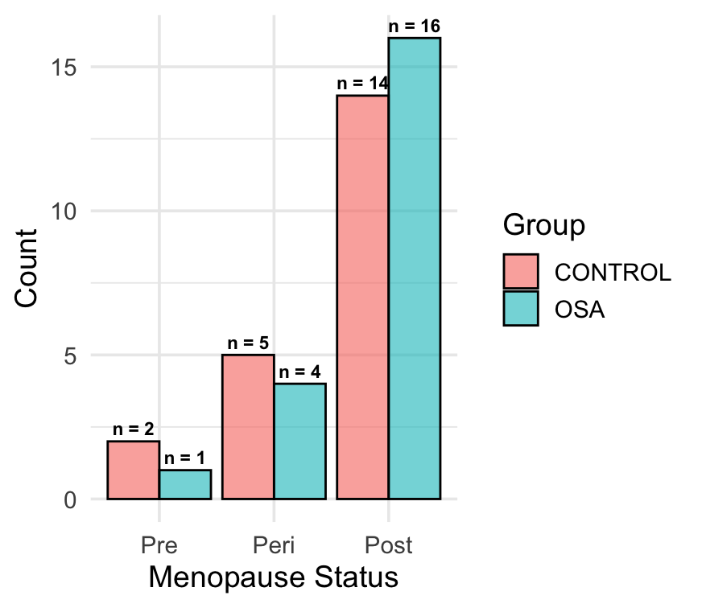
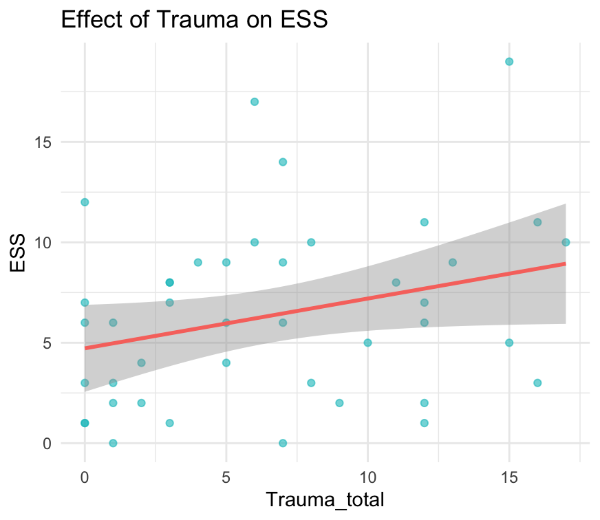
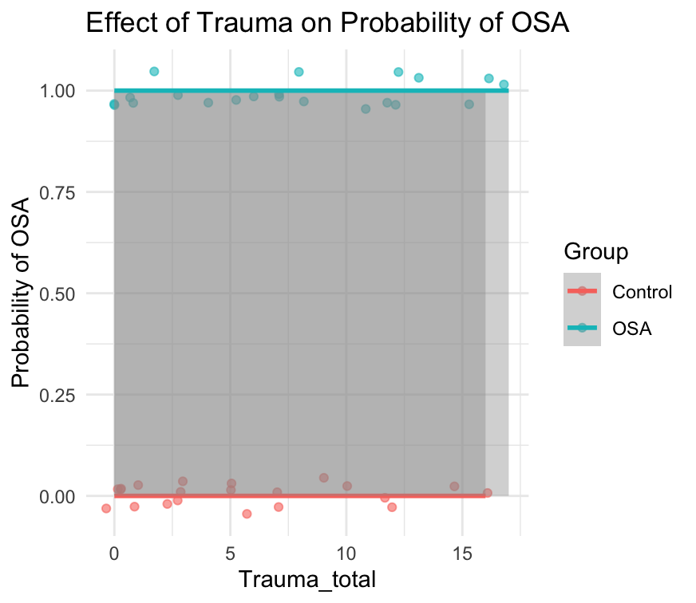

# R Course for Beginners
---

# Project Overview
This repository contains my final project for the R course, which investigates the relationship between childhood trauma, obstructive sleep apnea (OSA), and daytime sleepiness (ESS). The project involves data processing, statistical analysis (linear & logistic regression), and visualization.

The dataset files and R script files are also included in this repository.

The dataset was obtained from Harvard Dataverse and can be accessed at: [Dataverse Harvard](https://dataverse.harvard.edu/dataset.xhtml?persistentId=doi:10.7910/DVN/87IHIW).

# A. Dataset and Research Question

## Dataset Description

The dataset "OSA and childhood trauma" includes measures of childhood trauma history (ETISR-SF subscales), health indicators (BMI, Age, Menopause status), and sleep-related factors (Epworth Sleepiness Scale [ESS], OSA diagnosis). The dataset contains 42 observations split into two groups: Control and OSA.

## Why This Dataset?

I chose this dataset because my research focuses on childhood abuse. Since my doctoral work does not include experimental/control groups, this dataset allowed me to gain experience analyzing data with distinct comparison groups (OSA vs. Control) and apply statistical techniques that I wouldn’t normally use in my research.

## Research Question

_Does OSA mediate the relationship between childhood trauma history and daytime sleepiness (ESS)?_

# B. Exploratory Data Analysis

## Descriptive Statistics

Below is a summary of the main variables split by Group (Control vs. OSA):

```
 ── Data Summary ────────────────────────  
  Group      Age_mean  Age_sd   Age_range  BMI_mean  BMI_sd   BMI_range   ESS_mean  ESS_sd  ESS_range   Trauma_total_mean   Trauma_total_sd   
1 CONTROL     53.0      9.09      35 - 70     25.1    4.99   18.8 - 37.5    4.71     3.51    0 - 12           5.57                5.08  
2 OSA         59        11.9      34 - 77     33.0    7.63   23.8 - 54.8    8        4.77    1 - 19           7.62                5.44 

```




# C. Data Processing

1. Created Trauma_total as the sum of ETISR-SF subscales.
2. Converted Group into a binary variable (Group_binary where OSA = 1, Control = 0).
3. Wrote a custom function (calculate_summary()) for grouped summary statistics.
4. Used an external package (skimr) to summarize the dataset.

# D. Statistical Analyses

## 1. Multiple Linear Regression: ESS ~ Trauma_total + Age + BMI

```
Call:
lm(formula = ESS ~ Trauma_total + Age + BMI, data = data)

Coefficients:
             Estimate Std. Error t value Pr(>|t|)
(Intercept)  -2.45640    4.28470  -0.573    0.570
Trauma_total  0.18371    0.13169   1.395    0.171
Age           0.05970    0.06090   0.980    0.333
BMI           0.14636    0.09273   1.578    0.123
```
Conclusion: The relationship between trauma and ESS is not statistically significant (p = 0.171).



## 2. Logistic Regression: Group_binary ~ Trauma_total + Age + BMI

```
Call:
glm(formula = Group_binary ~ Trauma_total + Age + BMI, family = binomial, data = data)

Coefficients:
              Estimate Std. Error z value Pr(>|z|)   
(Intercept)  -11.49287    3.80281  -3.022  0.00251 **
Trauma_total   0.02267    0.08137   0.279  0.78056   
Age            0.07367    0.03857   1.910  0.05613 .
BMI            0.25763    0.09233   2.790  0.00526 **
```

Conclusion: Trauma does not predict OSA, but BMI is a strong predictor (p = 0.005).



# F. Summary of Findings

- Childhood trauma is not a significant predictor of daytime sleepiness (ESS).
- Trauma does not predict OSA, meaning there is no mediation effect.
- BMI is a strong predictor of OSA (p = 0.005).
