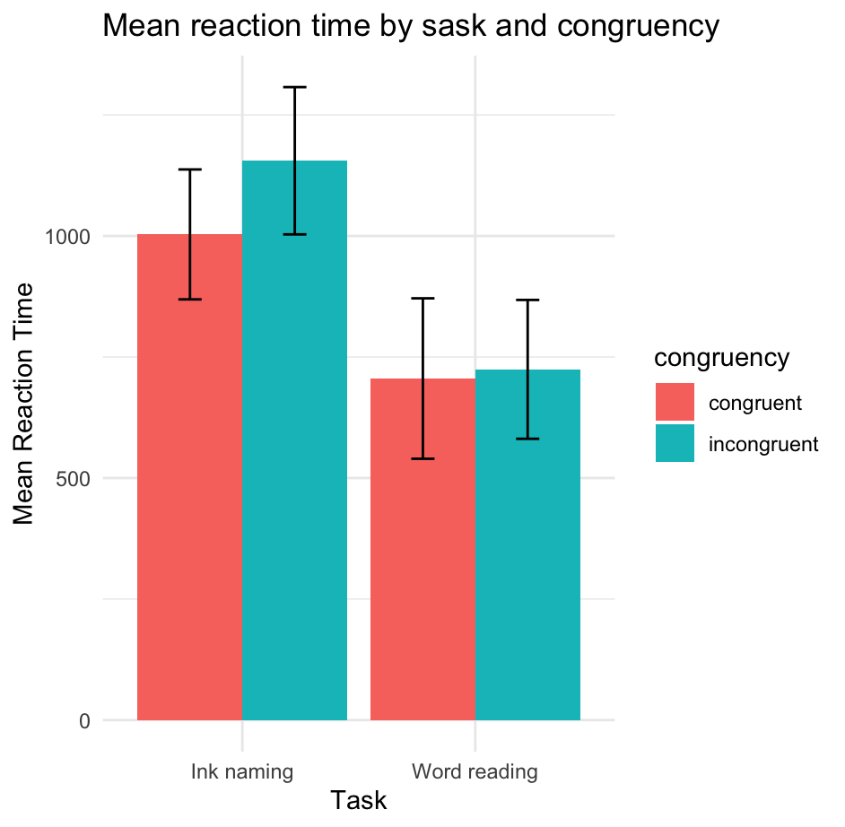

# R Course for Beginners
---

## Project Overview

This repository includes two main projects:
1. **Stroop Experiment**: Analysis of response times under different conditions.
2. **Descriptive Statistics Assignment**: Calculation of summary statistics for a synthetic dataset.

## A. Stroop experiment
The Stroop experiment analyzes the impact of task congruency on reaction times. Below are the summary statistics and a visualization of the results.


### Mean and Standard Deviation for Each Condition

```
  task         congruency  mean_rt sd_rt
1 ink_naming   congruent     1003.  134.
2 ink_naming   incongruent   1155.  152.
3 word_reading congruent      705.  166.
4 word_reading incongruent    724.  143.
```
### Visualization of Results



---

## B. Descriptive statistics assignment
This assignment involves generating a dataset and calculating descriptive statistics for both continuous and categorical variables.

### Descriptive Statistics Results

```
            Variable          Statistic        Value
1            Subject               Mean 1.000000e+01
2            Subject Standard Deviation 3.316625e+00
3            Subject                Min 5.000000e+00
4            Subject                Max 1.500000e+01
5                Age               Mean 4.158832e+01
6                Age Standard Deviation 1.276285e+01
7                Age                Min 1.991337e+01
8                Age                Max 5.818700e+01
female        Gender    Count of female 6.000000e+00
male          Gender      Count of male 5.000000e+00
11     Response_Time               Mean 2.353303e+03
12     Response_Time Standard Deviation 1.609246e+03
13     Response_Time                Min 4.658208e+02
14     Response_Time                Max 5.175401e+03
15        Depression               Mean 6.081458e+01
16        Depression Standard Deviation 2.515154e+01
17        Depression                Min 6.247733e-02
18        Depression                Max 8.146400e+01
19     Average_Sleep               Mean 7.074302e+00
110    Average_Sleep Standard Deviation 3.235926e+00
111    Average_Sleep                Min 3.028646e+00
112    Average_Sleep                Max 1.184957e+01

```

---

For any questions, please contact me.
