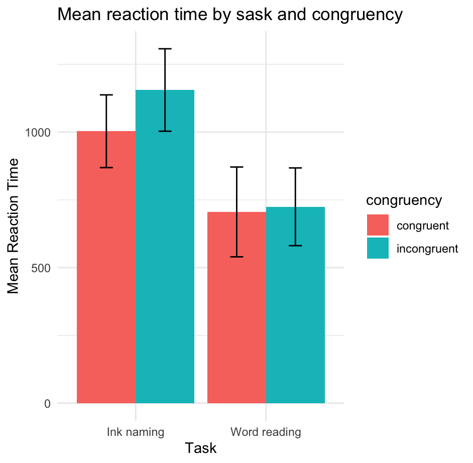

# Stroop Experiment Project
This repository contains the Stroop experiment analysis conducted during week 7.
## Results

### a. Calculate mean and SD for each condition
```
  task         congruency  mean_rt sd_rt
1 ink_naming   congruent     1003.  134.
2 ink_naming   incongruent   1155.  152.
3 word_reading congruent      705.  166.
4 word_reading incongruent    724.  143.
```

### b. Plot



